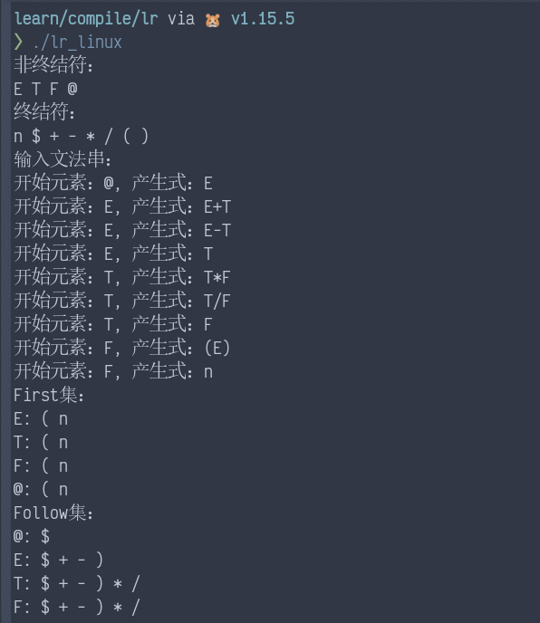
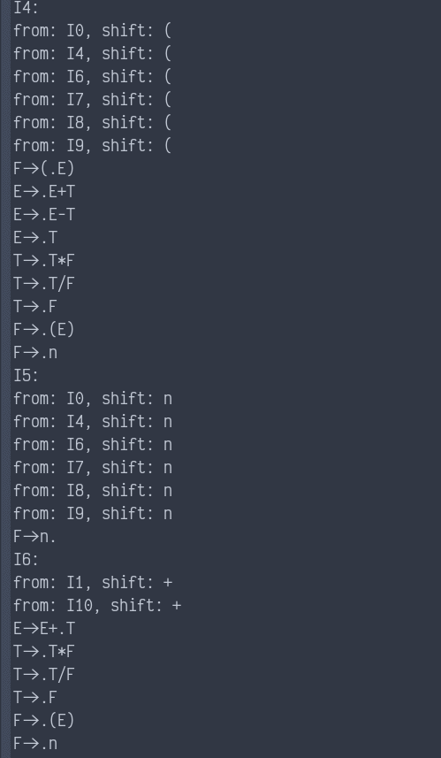
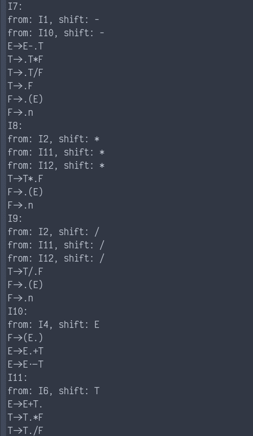
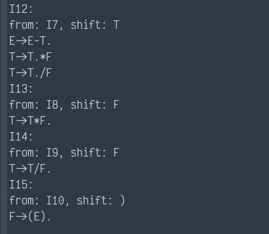
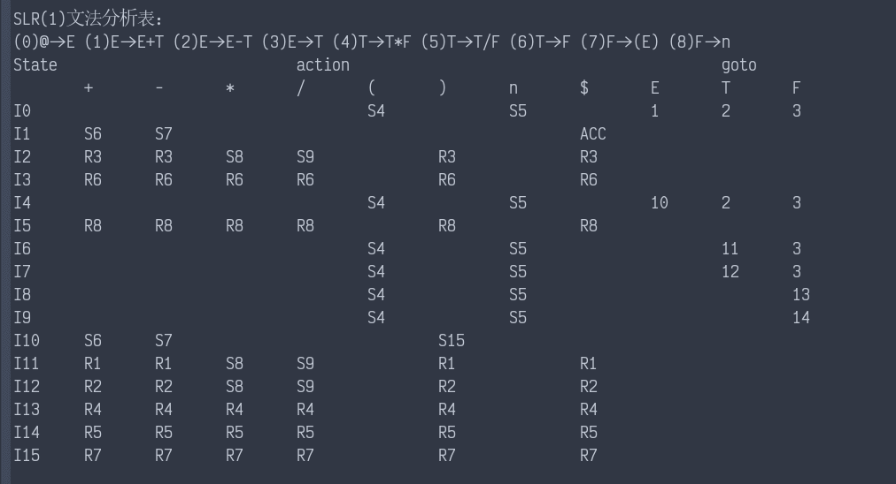
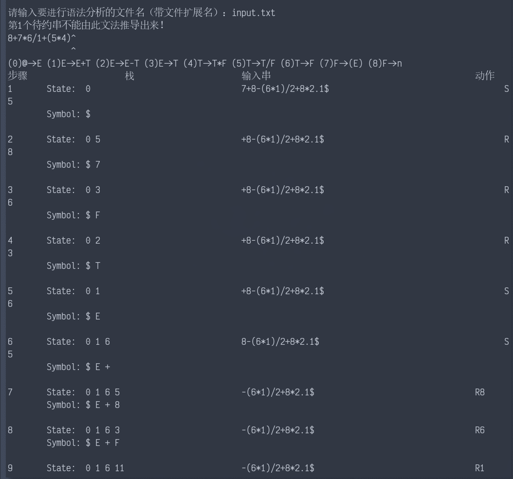
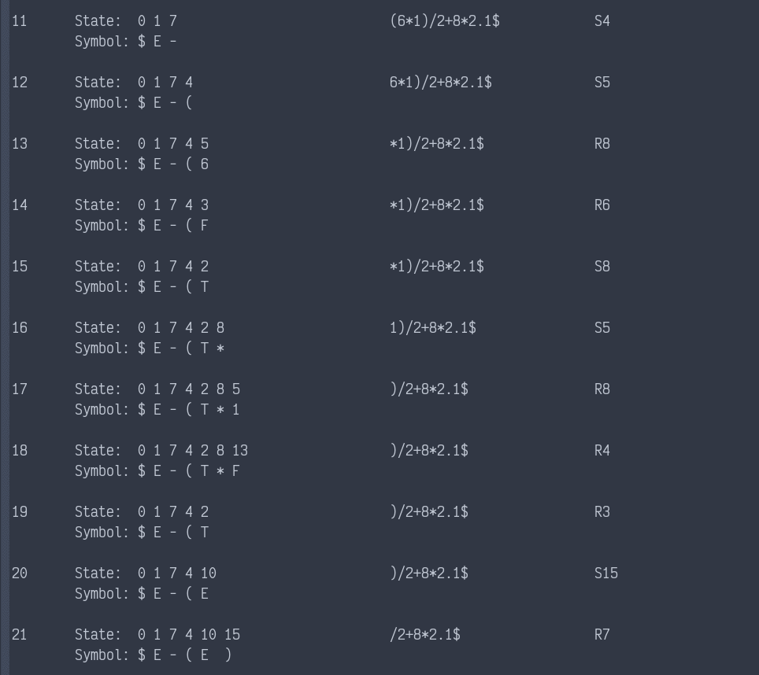
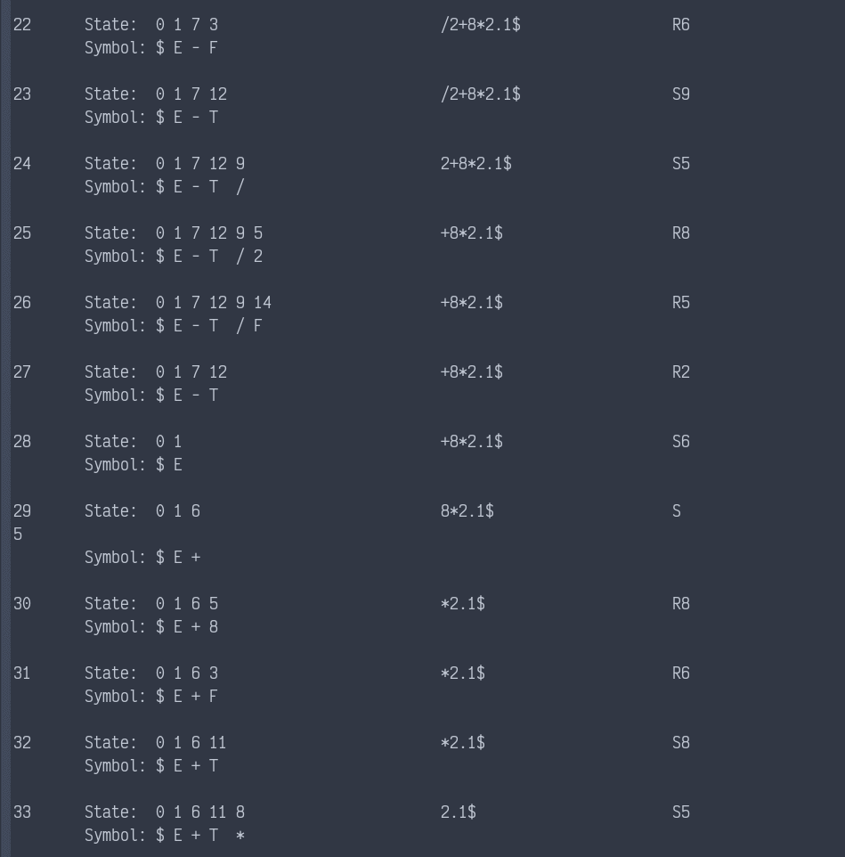
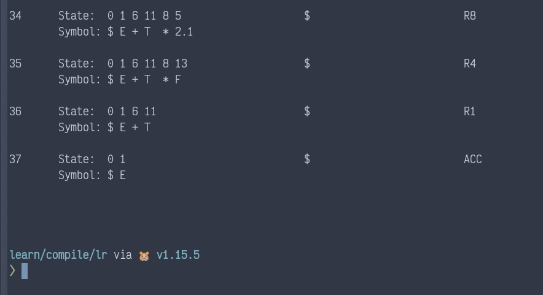

# Table of Contents

1.  [运行截图](#org6c6c232)
2.  [如何运行](#orgc5ab2fb)
3.  [程序功能](#org351ec9e)
4.  [程序逻辑](#org3a4c14c)
5.  [程序结构体](#org7384552)
6.  [程序全局变量](#orgee6353c)

# 运行截图

-   文法串识别和 FIRST/FOLLOW
    
    

-   求得的项目族
    
    
    
    
    
    
    
    

-   文法分析表
    
    

-   待约串分析动作表
    
    
    
    
    
    
    
    

# 如何运行

-   Windows
    
    点击 lr.exe 即可

-   Linux
    
    ./lr\_linux

-   MacOS
    
    ./lr\_mac

# 程序功能

1.  读取存储满足要求的文法串的文件
    
    文法的要求：
    
    1.  设计正确的 SLR(1)文法
    2.  文法串中的大写字母表示非终结符，小写字母(除 n)和符号(除@)表示终结符，n表示数字
    3.  不同文法串用换行符分隔
2.  分析输入的文法串
    1.  输出文法中的非终结符和终结符
    2.  输出文法中非终结符的 FIRST, FOLLOW 集
    3.  输出 SLR(1)形式的文法项目族
    4.  输出 SLR(1)形式的分析表
3.  读取存储待约串的文件（不同待约串按行分隔）
4.  输出所有待约串的分析过程（可以检测无法推出的待约串）

# 程序逻辑

1.  读取输入的文法串
2.  求输入文法串的 FIRST/FOLLOW 集
3.  求文法规范项目族
4.  求文法分析表
5.  读取输入的待约串集
6.  对每一条待约串进行语法分析并输出分析动作表

# 程序结构体

1.  expMap: 存储文法串
    -   start:  文法串的开始符号
    -   subExp: 文法串的产生式
2.  source: 用来确定来源项目集
    -   from:  项目集来源的序号
    -   shift: 移进的符号
3.  solu: 项目集
    -   sources: 此项目集的来源
    -   list:    此项目集中的文法串
    -   isTran:  项目集中的文法串是否被遍历
4.  place: 二维序号
    -   x: 项目集序号
    -   y: 项目集中产生式序号
5.  table: 文法分析表
    -   action: action 表
    -   goTo: goto 表
6.  stack: 状态符号栈
    -   state:  状态
    -   symbol: 符号
7.  doline: 分析动作表的一行
    -   no: 步骤
    -   st: 状态符号栈
    -   s:  当前状态下的剩余符号串
    -   do: 分析动作

# 程序全局变量

1.  oriBegin:    拓广之前的文法开始符号
2.  begin:       拓广之后的文法开始符号
3.  beginSubExp: 拓广之后的文法开始符号的产生式
4.  vCnt:        非终结符计数
5.  tCnt:        终结符计数
6.  vs:          非终结符的 map
7.  ts:          终结符的 map
8.  exps:        文法串数组
9.  first:       文法 FIRST 集
10. follow:     文法 FOLLOW 集
11. flag:       标志某非终结符（用于求 FOLLOW 集）
12. solus:      文法项目族
13. aTable:     文法分析表
14. inputArr:   输入待约串集
15. cInput:     当前规约串
16. aDoTable:   分析动作表
17. errIndex:   当前规约串中错误位置

# TODO
-   [ ] 识别空产生式
-   [ ] 添加对二义性文法的判断
